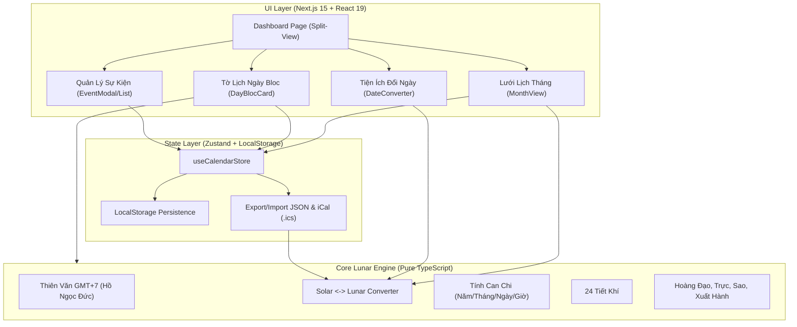

# Đặc Tả Kỹ Thuật (Design Spec): Ứng Dụng Lịch Âm Dương Việt Nam

- **Ngày tạo**: 2026-09-13
- **Trạng thái**: Chờ duyệt (Pending Review)
- **Công nghệ**: Next.js 15 (App Router, React 19), TypeScript, Tailwind CSS, Lucide React, Zustand, Vitest

---

## 1. Mục Tiêu & Phạm Vi Dự Án (Executive Summary & Scope)

### 1.1 Mục tiêu
Xây dựng một ứng dụng Lịch Âm Dương (Lịch Vạn Niên) hiện đại, chính xác cao theo chuẩn thiên văn Việt Nam (múi giờ GMT+7 / UTC+7). Ứng dụng kết hợp giữa tra cứu lịch truyền thống và quản lý các sự kiện tâm linh / gia đình quan trọng (ngày giỗ, ngày rằm, mùng một, sinh nhật âm lịch), hoạt động theo mô hình Local-first (offline, bảo mật dữ liệu, không cần tài khoản).

### 1.2 Phạm vi tính năng (Scope)
1. **Lịch Vạn Niên & Thiên Văn**:
   - Chuyển đổi hai chiều chính xác giữa Dương lịch và Âm lịch (hỗ trợ năm 1900 - 2100).
   - Xác định Can Chi (năm, tháng, ngày, giờ).
   - 24 Tiết khí trong năm.
   - Nhận biết năm nhuận, tháng nhuận (29 ngày hoặc 30 ngày).
   - Thông tin phong thủy vạn niên: 12 Giờ Hoàng Đạo / Hắc Đạo, Thập Nhị Trực, Nhị Thập Bát Tú (28 sao cát/hung), Hướng xuất hành (Hỷ thần / Tài thần).
2. **Quản Lý Sự Kiện & Lời Nhắc (Local-first)**:
   - Tạo sự kiện theo ngày âm lịch hoặc dương lịch.
   - Hỗ trợ lặp lại: một lần (once), lặp hàng năm (yearly - ngày giỗ, sinh nhật), lặp hàng tháng (monthly - rằm 15, mùng 1).
   - Tự động map sự kiện âm lịch sang các ngày dương lịch tương ứng trong tháng.
   - Nhắc nhở: Banner sự kiện sắp tới (3 - 7 ngày), Web Notification.
   - Xuất file iCalendar (`.ics`) để đồng bộ trực tiếp vào Google Calendar / Apple Calendar.
   - Sao lưu và phục hồi dữ liệu: Export & Import JSON.
3. **Giao Diện & Trải Nghiệm (UI/UX)**:
   - Dashboard Split-view: Lưới Lịch Tháng kết hợp Tờ Lịch Ngày phong cách Bloc truyền thống.
   - Responsive hoàn hảo trên Mobile (Bottom navigation chuyển đổi linh hoạt).
   - Giao diện Sáng (Light) & Tối (Dark mode).
   - Công cụ chuyển đổi Âm - Dương nhanh (Date Converter).
   - Hỗ trợ PWA (Progressive Web App) cài đặt lên màn hình chính điện thoại và chạy offline.

---

## 2. Kiến Trúc Kỹ Thuật (Architecture & Tech Stack)



### 2.1 Thành phần công nghệ
- **Framework**: Next.js 15.x (App Router, React 19).
- **Ngôn ngữ**: TypeScript 5.x (Strict mode).
- **Styling**: Tailwind CSS, Class Variance Authority, Tailwind Merge.
- **Iconography**: Lucide React.
- **Quản lý trạng thái**: Zustand (với middleware `persist`).
- **Date calculation**: Pure TypeScript (zero external heavy date libraries).
- **Kiểm thử**: Vitest.

---

## 3. Cấu Trúc Thư Mục Chi Tiết

```text
lich-am-duong/
├── docs/
│   └── superpowers/
│       └── specs/
│           └── 2026-09-13-lich-am-duong-design.md
├── src/
│   ├── app/
│   │   ├── layout.tsx                # Root layout, Google fonts, Metadata SEO
│   │   ├── page.tsx                  # Dashboard (Split-view Month + Bloc)
│   │   ├── doi-ngay/page.tsx         # Trang tiện ích chuyển đổi Âm - Dương
│   │   ├── su-kien/page.tsx          # Trang danh sách sự kiện & quản lý
│   │   ├── manifest.ts               # PWA Web Manifest
│   │   └── globals.css               # Tailwind styles & theme variables
│   ├── components/
│   │   ├── calendar/
│   │   │   ├── MonthView.tsx         # Lưới lịch tháng
│   │   │   ├── DayBlocCard.tsx       # Tờ lịch ngày bloc truyền thống
│   │   │   ├── DayDetailModal.tsx    # Modal chi tiết phong thủy của ngày
│   │   │   └── QuickNav.tsx          # Điều hướng nhanh tháng/năm, về Hôm nay
│   │   ├── events/
│   │   │   ├── EventModal.tsx        # Dialog tạo/sửa sự kiện
│   │   │   ├── EventList.tsx         # Danh sách sự kiện sắp xếp theo ngày
│   │   │   └── UpcomingBanner.tsx    # Banner nhắc nhở sự kiện sắp tới
│   │   ├── converter/
│   │   │   └── DateConverter.tsx     # Form chuyển đổi 2 chiều Âm <-> Dương
│   │   ├── layout/
│   │   │   ├── Header.tsx            # Header ứng dụng, theme toggle, mobile menu
│   │   │   └── MobileNav.tsx         # Thanh điều hướng bottom trên mobile
│   │   └── ui/                       # UI primitives (Button, Dialog, Input, Select, Badge, Card...)
│   ├── lib/
│   │   ├── lunar/                    # Core Lunar Engine (Pure TS, zero external deps)
│   │   │   ├── types.ts              # Type definitions (LunarDate, SolarDate, CanChi, DayInfo...)
│   │   │   ├── astronomical.ts       # Thuật toán thiên văn vị trí Mặt Trời / Mặt Trăng
│   │   │   ├── converter.ts          # Chuyển đổi solarToLunar & lunarToSolar
│   │   │   ├── canchi.ts             # Tính toán Can Chi năm/tháng/ngày/giờ
│   │   │   ├── tietkhi.ts            # Tính 24 Tiết khí
│   │   │   ├── phongthuy.ts          # Giờ hoàng đạo, Thập nhị trực, 28 sao, hướng xuất hành
│   │   │   └── constants.ts          # Hằng số mảng Can, Chi, Trực, Sao, Tiết khí
│   │   ├── store/
│   │   │   └── useCalendarStore.ts   # Zustand store quản lý selectedDate, events, filters
│   │   ├── ical/
│   │   │   └── generator.ts          # Sinh nội dung chuẩn .ics RFC 5545
│   │   └── utils.ts                  # Helper classes merge, format
│   └── tests/
│       ├── lunar/
│       │   ├── converter.test.ts     # Kiểm thử chuyển đổi âm dương
│       │   ├── canchi.test.ts        # Kiểm thử can chi & năm nhuận
│       │   └── phongthuy.test.ts     # Kiểm thử giờ hoàng đạo & trực/sao
│       └── ical/
│           └── generator.test.ts     # Kiểm thử tạo file iCal
├── public/
│   ├── icons/                        # PWA icons (192x192, 512x512)
│   └── favicon.ico
├── package.json
├── tsconfig.json
├── tailwind.config.ts
└── vitest.config.ts
```

---

## 4. Chi Tiết Lõi Thuật Toán Thiên Văn & Âm Lịch (Core Lunar Engine)

### 4.1 Cơ sở lý thuyết
- Áp dụng thuật toán thiên văn chuẩn của TS. Hồ Ngọc Đức (Viện Công nghệ Thông tin), tính toán tọa độ theo múi giờ Việt Nam (kinh độ 105° Đông, UTC+7).
- Một tháng âm lịch bắt đầu vào ngày có điểm Sóc (New Moon).
- Tháng nhuận được xác định theo nguyên tắc: Nếu giữa hai tháng 11 âm lịch (tháng chứa ngày Đông chí) có 13 tháng âm thì tháng đầu tiên không có Trung khí là tháng nhuận.

### 4.2 Type Definitions
```typescript
export interface SolarDate {
  day: number;
  month: number;
  year: number;
}

export interface LunarDate {
  day: number;
  month: number;
  year: number;
  isLeap: boolean;    // true nếu rơi vào tháng nhuận
  leapMonth?: number; // Tháng nhuận của năm đó (nếu có)
}

export interface CanChiInfo {
  yearCanChi: string;   // Ví dụ: "Giáp Thìn"
  monthCanChi: string;  // Ví dụ: "Nhâm Thân"
  dayCanChi: string;    // Ví dụ: "Bính Tuất"
  hourCanChi: string;   // Ví dụ: "Mậu Tý"
}

export interface DayFengShui {
  hoangDaoHours: string[];  // 6 giờ Hoàng đạo (ví dụ: ["Dần (03:00 - 05:00)", "Thìn (07:00 - 09:00)", ...])
  hacDaoHours: string[];    // 6 giờ Hắc đạo
  tietKhi: string;          // Ví dụ: "Bạch lộ"
  truc: string;             // Ví dụ: "Kiến" kèm đánh giá
  sao: string;              // Ví dụ: "Giác Mộc Giảo" kèm Cát/Hung
  huongXuatHanh: {
    hyThan: string;         // Ví dụ: "Hướng Đông Bắc"
    taiThan: string;        // Ví dụ: "Hướng Đông Nam"
  };
}

export interface FullDayInfo {
  solar: SolarDate;
  lunar: LunarDate;
  canChi: CanChiInfo;
  fengShui: DayFengShui;
  isToday: boolean;
  dayOfWeek: number;        // 0: Chủ nhật, 1: Thứ 2, ..., 6: Thứ 7
}
```

### 4.3 Các module cốt lõi
1. `converter.ts`:
   - `solarToLunar(solarDay, solarMonth, solarYear): LunarDate`
   - `lunarToSolar(lunarDay, lunarMonth, lunarYear, isLeap): SolarDate`
   - `getDaysInLunarMonth(lunarMonth, lunarYear, isLeap): number` (trả về 29 hoặc 30)
2. `canchi.ts`:
   - Tính Thiên Can (Giáp, Ất, Bính, Đinh, Mậu, Kỷ, Canh, Tân, Nhâm, Quý).
   - Tính Địa Chi (Tý, Sửu, Dần, Mão, Thìn, Tỵ, Ngọ, Mùi, Thân, Dậu, Tuất, Hợi).
   - Chu kỳ ngày Julien để tìm Can Chi ngày chuẩn xác liên tục qua các thế kỷ.
3. `tietkhi.ts`:
   - Tính toán theo kinh độ mặt trời tại múi giờ 7 để xác định thời điểm bắt đầu 24 tiết khí.
4. `phongthuy.ts`:
   - Tra bảng Giờ Hoàng Đạo theo Chi ngày.
   - Tra bảng Thập Nhị Trực theo Chi tháng và Chi ngày.
   - Tra bảng 28 Sao (Nhị thập bát tú) theo thứ tự ngày liên tục.
   - Tra bảng Hướng Hỷ Thần / Tài Thần theo Can ngày.

---

## 5. Quản Lý Trạng Thái & Dữ Liệu Sự Kiện (State & Events)

### 5.1 Cấu trúc Sự Kiện (`CalendarEvent`)
```typescript
export interface CalendarEvent {
  id: string;
  title: string;
  description?: string;
  calendarType: 'lunar' | 'solar';
  date: {
    day: number;
    month: number;
    year?: number; // Optional nếu lặp lại hàng năm
  };
  recurrence: 'once' | 'yearly' | 'monthly';
  color?: string; // Mã màu hex hoặc tên màu định sẵn
  reminderDaysBefore: number; // 0, 1, 3, 7 ngày
  createdAt: string;
}
```

### 5.2 Zustand Store (`useCalendarStore.ts`)
```typescript
interface CalendarState {
  selectedDate: string; // ISO date format 'YYYY-MM-DD'
  viewDate: { year: number; month: number }; // Tháng đang hiển thị trên lưới
  events: CalendarEvent[];
  activeView: 'month' | 'bloc' | 'events' | 'converter';

  // Actions
  setSelectedDate: (dateStr: string) => void;
  setViewDate: (year: number, month: number) => void;
  goToToday: () => void;
  setActiveView: (view: 'month' | 'bloc' | 'events' | 'converter') => void;

  addEvent: (event: Omit<CalendarEvent, 'id' | 'createdAt'>) => void;
  updateEvent: (id: string, event: Partial<CalendarEvent>) => void;
  deleteEvent: (id: string) => void;
  importEvents: (jsonString: string) => { success: boolean; count?: number; error?: string };
  exportEventsJSON: () => string;
}
```

### 5.3 Thuật toán khớp sự kiện (Event Matching Engine)
Với một ngày Dương lịch $D_{solar}$:
1. Tìm sự kiện Dương lịch:
   - `recurrence === 'once'` và $D_{solar}$ khớp đúng Ngày/Tháng/Năm.
   - `recurrence === 'yearly'` và $D_{solar}$ khớp đúng Ngày/Tháng.
2. Chuyển $D_{solar}$ sang Âm lịch $D_{lunar}$:
   - `recurrence === 'once'` và $D_{lunar}$ khớp Ngày/Tháng/Năm (và tháng nhuận nếu có).
   - `recurrence === 'yearly'` và $D_{lunar}$ khớp Ngày/Tháng (sự kiện ngày Giỗ, sinh nhật âm).
   - `recurrence === 'monthly'` và $D_{lunar}.day === event.date.day$ (ví dụ: ngày 15 Rằm hàng tháng hoặc Mùng 1 hàng tháng).

### 5.4 Đồng bộ iCalendar (`generator.ts`)
- Tính trước các ngày dương tương ứng của các sự kiện âm lịch cho năm hiện tại và năm tiếp theo.
- Tạo chuỗi iCalendar `.ics` chuẩn RFC 5545:
  - `BEGIN:VCALENDAR`
  - `PRODID:-//Lich Am Duong Viet Nam//VN`
  - `BEGIN:VEVENT`
  - `SUMMARY:[Tiêu đề]`
  - `DTSTART;VALUE=DATE:YYYYMMDD`
  - `VALARM`: Thông báo trước theo `reminderDaysBefore`.
  - `END:VEVENT`
  - `END:VCALENDAR`
- Tải về trực tiếp từ trình duyệt qua Data URI / Blob.

---

## 6. Thiết Kế Giao Diện & Tương Tác (UI/UX)

### 6.1 Bố cục Split-View (Desktop)
- **Header**:
  - Logo + Tiêu đề "Lịch Âm Dương".
  - Bộ chọn tháng / năm linh hoạt + Nút "Hôm nay".
  - Nhóm nút thao tác: "Đổi ngày", "Sự kiện", "Xuất iCal", Theme Toggle (Light/Dark).
- **Trái (65% width)**:
  - `UpcomingBanner`: Danh sách trượt hiển thị các sự kiện trong 7 ngày tới kèm nhãn số ngày còn lại.
  - `MonthView`: Lưới 7 cột (Thứ 2 đến Chủ nhật).
    - Header thứ: T2, T3, T4, T5, T6, T7, CN (CN và T7 có màu nhấn cuối tuần).
    - Mỗi ô ngày: Số ngày Dương to; Số ngày Âm nhỏ góc dưới; Ngày Mùng 1 âm hiển thị dạng `1/X` kèm màu đỏ nổi bật; Chấm tròn đánh dấu sự kiện cá nhân.
- **Phải (35% width)**:
  - `DayBlocCard`:
    - Phần trên: Tờ lịch bloc màu đỏ truyền thống, hiển thị Thứ, Ngày Dương lớn, Tháng/Năm.
    - Phần giữa: Ngày Âm lịch to rõ, Can Chi 4 trụ (Năm, Tháng, Ngày, Giờ hiện tại), Tiết khí.
    - Phần dưới: Bảng thông tin phong thủy: 6 Giờ Hoàng Đạo, Trực ngày, Sao trực nhật, Hướng xuất hành.
    - Danh sách sự kiện của riêng ngày đó + Nút "+ Thêm sự kiện".

### 6.2 Bố cục Mobile Responsive
- Header rút gọn.
- Thanh chuyển tab ở đáy (Bottom Navigation bar):
  - [Lịch Tháng] - [Lịch Bloc] - [Sự Kiện] - [Đổi Ngày].
- Hỗ trợ vuốt (swipe gestures) trái/phải để đổi tháng.

---

## 7. Kiểm Thử & Đảm Bảo Chất Lượng (Testing Strategy)

### 7.1 Bộ kiểm thử Vitest
1. **`converter.test.ts`**:
   - Kiểm tra ngày Tết Nguyên Đán các năm:
     - 2024: 10/02/2024 -> 01/01/2024 Âm lịch (Giáp Thìn).
     - 2025: 29/01/2025 -> 01/01/2025 Âm lịch (Ất Tỵ).
     - 2026: 17/02/2026 -> 01/01/2026 Âm lịch (Bính Ngọ).
   - Kiểm tra năm nhuận: Năm 2023 nhuận tháng 2 Âm lịch.
   - Kiểm tra chuyển đổi ngược `lunarToSolar` đảm bảo tính chất đối xứng $A = lunarToSolar(solarToLunar(A))$.
2. **`canchi.test.ts`**:
   - Kiểm tra Can Chi của năm 2024 (Giáp Thìn), 2025 (Ất Tỵ), 2026 (Bính Ngọ).
   - Kiểm tra Can Chi ngày và giờ.
3. **`phongthuy.test.ts`**:
   - Kiểm tra 6 giờ Hoàng đạo chính xác theo từng Chi ngày (Tý, Sửu, Dần...).
   - Kiểm tra Tiết khí của các ngày đặc biệt (Xuân phân ~21/03, Đông chí ~22/12).
4. **`generator.test.ts`**:
   - Kiểm tra cú pháp `.ics` tạo ra đáp ứng chuẩn RFC 5545.
5. **`store.test.ts`**:
   - Kiểm tra thêm/sửa/xóa sự kiện, logic lọc sự kiện theo ngày âm/dương.

### 7.2 Xử lý Hydration & SSR
- Sử dụng Custom Hook `useMounted()` để hoãn việc render dữ liệu phụ thuộc thời gian client / `localStorage` cho đến khi component mount trên trình duyệt, loại bỏ 100% lỗi Hydration Warning của Next.js.
